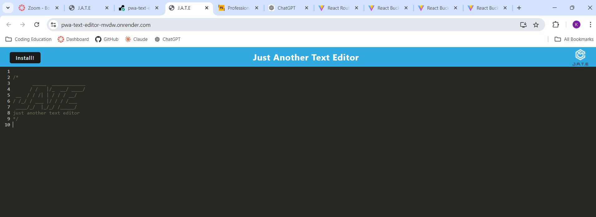
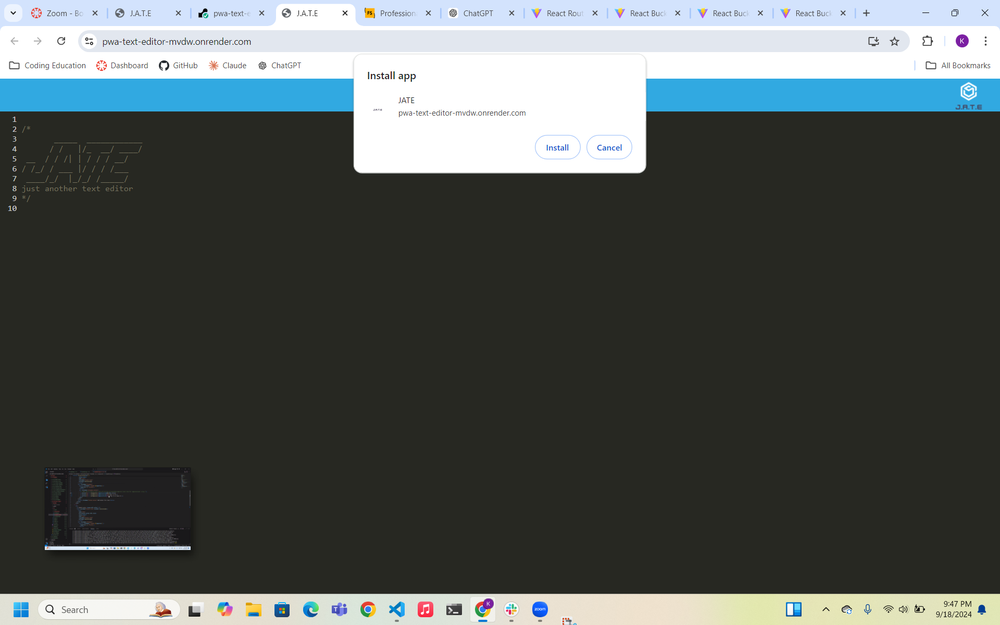

# PWA Text Editor

## Description

To have quick access to a text editor this web application was created to get and store text.

## Table of Contents (Optional)

If your README is long, add a table of contents to make it easy for users to find what they need.

- [Installation](#installation)
- [Usage](#usage)
- [License](#license)

## Installation

After downloading the code in the terminal run npm install then npm run build then npm run start:dev. Then open in localhost:3000. 

## Usage

You can visit the site at https://pwa-text-editor-mvdw.onrender.com/. Here you can write and save text on this editor that can be retrieved the next time you open the website.

## License

MIT License.

